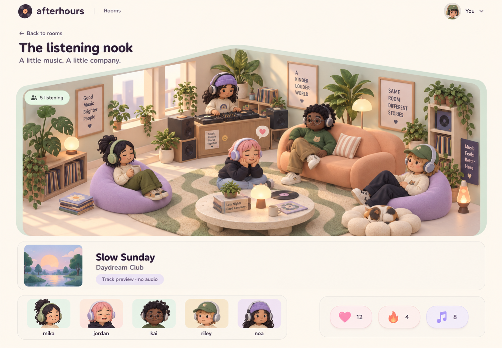
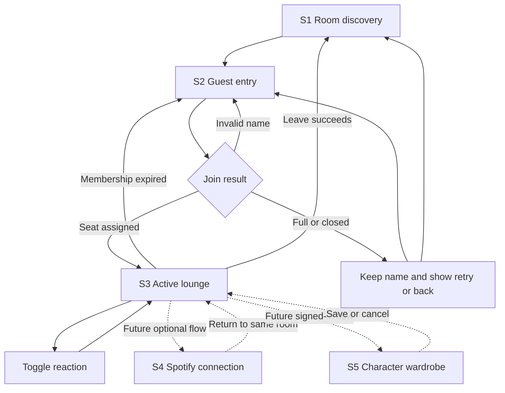

# Social lounge design flow

Status: design reference for review before implementation. The pastel visual direction and social-first product purpose are approved. Future interactions below are proposals, not implemented features or permission to add backend domains.

## Purpose and source of truth

Afterhours is the working name for a cozy place to socialize around music. Spotify is the intended music provider; Afterhours owns the room experience and characters. The final name remains undecided.

Read this document with [product scope](product.md) and [architecture](architecture.md). Use the current room API for the visual redesign. Define and approve later behavior before creating its contracts or database tables.



The concept establishes palette, softness, room prominence, and character proportions. Its names, sample counts, reaction icons, profile menu, and detailed assets do not change the product contract. Keep the seeded 2AM Lounge, DJ Nova, current mock track, and heart/fire/cry reactions. The music-note reaction in the image is illustrative. Character models and furniture of this quality require an asset plan; the image is not a playable 3D scene.

## Visual rules

| Element | Direction |
| --- | --- |
| Palette | Cream `#FFF8EE` background, mint `#D6EBDD`, lilac `#E4DCF4`, peach `#F3C6AF`, plum `#393444` text. Check contrast in the rendered interface. |
| Type | Rounded, friendly headings with a readable sans-serif body. Font choice remains part of the screen prototype; avoid widely spaced uppercase utility labels. |
| Surfaces | Rounded panels, gentle shadows, tactile buttons, visible borders and focus. Text and controls must remain distinguishable on light backgrounds. |
| Main scene | Fixed-camera cozy diorama, soft materials, rounded furniture, visible faces and outfits. Keep the existing DJ and five listener positions. |
| Character direction | Rounded proportions, varied appearances, readable silhouettes. Plan replaceable hair/clothing/accessory parts before building customization. |
| Motion | Subtle idle motion and reaction feedback; respect reduced motion. Do not plan animation synchronized to Spotify audio. |
| Product language | Direct labels such as Rooms, Join room, Leave room, and Try again. Describe mock metadata as "Track details only · no audio stream". |

The scene is the signature element. Keep surrounding controls quiet and easy to find. Do not add currencies, levels, quests, stores, or listening rewards based on the word "gamified"; those behaviors are unapproved.

## Screen inventory and sequence

| ID | Screen | Purpose | Delivery status |
| --- | --- | --- | --- |
| S1 | Room discovery | Choose an available room | Existing behavior; redesign next |
| S2 | Guest entry | Enter a name and request a seat | Existing behavior; redesign next |
| S3 | Active lounge | See people and track details, react, leave | Existing behavior; redesign next |
| S4 | Connection and playback | Connect Spotify and choose a supported personal listening mode | Future proposal; provider constraints unresolved |
| S5 | Character wardrobe | Preview and save appearance | Future proposal; identity and asset decisions required |



### S1: Room discovery

Show the brand, a short invitation, and room cards with a scene preview, room name, host, member count, and Join room action. Use actual returned rooms and counts. Keep the scene preview lighter than the active room so browsing does not require multiple full 3D scenes.

- Loading: reserve card space and show a loading status.
- Empty: explain that no rooms are available and offer refresh.
- Failed request: show Try again.
- Closed room: show its status and prevent a misleading join action.
- Capacity: the join response remains authoritative. The current summary has no listener-capacity field; do not infer free seats from total members, which includes the DJ.

### S2: Guest entry

Desktop uses a small dialog after choosing a room; a direct room URL uses the existing entry screen. Mobile uses a panel that fits above the keyboard. Show the selected room, display-name input, Join room, and Cancel or Back to rooms.

1. Keep the entered name while submitting or recovering from failure.
2. Trim and validate the name using the existing 1–24 character rule. Duplicate display names remain allowed.
3. Disable duplicate submission while joining. Only a successful server response admits the guest.
4. For full or closed rooms, show the server message with retry/back actions. Do not render a joined avatar optimistically.
5. Retry an uncertain join with the same tab session ID so it cannot reserve a second seat.

Spotify connection and character editing do not block entry in this redesign. A small default character illustration may explain how the guest will appear; it is not a character selector.

### S3: Active lounge

Desktop composition:

```text
Brand / Rooms                                      Your guest name
Back to rooms                 Room name                Leave room
+--------------------------------------------------------------+
| Member count                                                 |
|                                                              |
|        DJ booth + cozy room + assigned listener spots          |
|                  Characters are the main focus                |
|                                                              |
+--------------------------------------------------------------+
| Track title / artist                 Track details only       |
+--------------------------------------------------------------+
| Member portraits and names              Heart / Fire / Cry    |
+--------------------------------------------------------------+
| Connection or action feedback only when needed                |
```

Mobile order: compact header, room title/leave action, scene, track card, reactions, wrapping member list. Keep essential actions outside the canvas and within reach. Frame the scene for narrow screens without hiding the DJ or the user's place. Provide the member list and track details even if WebGL fails.

- Distinguish DJ and listeners with text as well as appearance. The seeded DJ is not a logged-in host who can operate playback controls.
- Show a roster equivalent of scene membership for keyboard and screen-reader users. Keep reactions accessible with labels, counts, and selected states.
- Reactions toggle the existing heart/fire/cry contract. Optimistic feedback rolls back on error; counts reconcile with the server.
- Room polling stays at five seconds; heartbeat stays at 20 seconds and lease expiry at 60 seconds. Do not introduce WebSockets for the reskin.
- During a transient refresh failure, retain the last scene with a stale/retry notice. Confirmed membership expiry returns the user to entry before further reactions.
- Leave succeeds before clearing the guest session and navigating away. A failed leave offers retry and keeps the room visible.
- Show no playback progress, audio preview, functional player buttons, wardrobe menu, or account controls until their capabilities exist.

## Spotify flow and provider boundary

### Constraints checked on 2026-09-26

Spotify's policy prohibits games and non-interactive broadcasting from one source to simultaneous listeners. It also restricts synchronizing recordings with visual media. These rules directly affect the proposed gamification and DJ-controlled listening model; using separate accounts does not by itself establish permission. The social-avatar use case still needs clarification before integration. [Spotify developer policy](https://developer.spotify.com/policy)

The Web Playback SDK creates a browser playback device. Browser playback needs an eligible Premium subscription, and user interaction may be required to start playback. Treat connection, player readiness, and actual playback as separate states. [SDK overview](https://developer.spotify.com/documentation/web-playback-sdk), [SDK reference](https://developer.spotify.com/documentation/web-playback-sdk/reference)

Provider content needs Spotify attribution and a link back. Plan a disconnect action and removal of associated provider personal data. [Spotify developer policy](https://developer.spotify.com/policy)

### Shared listening option discussed: Spotify Jam

A proposed first connected version lets a real host start a Jam in Spotify and share its invitation link in the Afterhours room. Listeners open the invitation, join in Spotify, and return to socialize in Afterhours. Spotify manages shared playback. Hosting and joining remotely require Premium. [Spotify Jam guide](https://support.spotify.com/cg-en/article/jam/)

No documented public Jam API was found during the research for this plan. Treat the invitation as a manually shared link; opening it does not confirm Jam membership, playback, or synchronization to Afterhours. Real host identity, permission to set/remove the link, and expired-session handling need a separate approved contract. This option is a recommendation, not a selected implementation or confirmation of the broader application's provider eligibility.

Custom synchronization using individual player controls remains a separate technical possibility with unresolved provider permission and timing reliability. Do not create a room playback coordinator from this discussion alone.

### S4: proposed personal listening flow

Keep two options open until the use case and available developer access are confirmed:

| Option | User experience | Backend consequence |
| --- | --- | --- |
| Listen in Spotify | User opens a track in Spotify and controls listening there | A simple link alone needs no playback service. Fetching provider data or showing personal state may still require authorization. |
| Spotify browser player | User connects an eligible account and explicitly enables a local player | Requires provider authorization, connection lifecycle, capability/error states, and a browser SDK integration. |

Neither option promises synchronized listening or makes the host authoritative over other users' players. The choice remains unapproved; opening Spotify externally is not a policy exemption.

Proposed connection flow: choose Connect Spotify → provider consent → return to the same room → show connected status → explicitly start a supported personal listening action. Consent denied or provider failure returns to the social room with a recovery action. Joining a room does not automatically start or transfer playback.

| State | User sees | Action |
| --- | --- | --- |
| Not connected | Connect Spotify | Begin consent when the integration is available |
| Consent cancelled | Spotify was not connected | Retry or continue socializing |
| Connected, no ready player | Connection succeeded; listening is not active | Open Spotify or enable the chosen player |
| Playback unavailable for account/device | Specific capability explanation | Keep room access; offer supported alternative |
| User gesture required | Start listening | Explicit interaction with the local player |
| Provider connection expired | Reconnect Spotify | Reauthorize without losing room membership |
| Provider temporarily unavailable | Listening controls unavailable | Retry when appropriate; keep social actions usable |
| Disconnected | Spotify connection removed | Stop provider access and remove associated provider personal data |

Track information in a room and what a particular user is actually hearing must be separately named and modeled. A room's mock track must never be presented as confirmed Spotify playback. Decide who may share a track and how before adding a live room track service.

## S5: proposed character flow

After persistent identity is designed: open My character → preview appearance → choose available hair, clothes, or accessories → Save → see the saved appearance in the room. Cancel restores the saved appearance. Failed saves retain the draft and offer retry.

- Local preview is immediate; only a successful save changes the authoritative appearance.
- The server validates allowed item IDs and ownership if ownership is introduced. Clients never submit arbitrary model URLs.
- Define a stable model rig, attachment points, asset IDs, and mobile performance budget before building the wardrobe API.
- Persistent characters need an application identity independent of a temporary guest session. Spotify connection must not silently convert or merge a guest identity.
- Guest customization, account creation/sign-in, migration from guest to account, and visibility to other users remain decisions for that phase.
- No purchases, unlocks, XP, chat, walking, or new emotes are included in the current redesign. If proposed later, define their product and provider implications separately.

## Screen-to-backend mapping

Current room base path: `/api/v1/rooms`. Guest mutation requests carry `x-guest-session-id`; schemas validate requests centrally.

| UI action | Existing request/data | Owner and authority |
| --- | --- | --- |
| Browse | `GET /api/v1/rooms` → `RoomSummary[]` | Core room service/repository; stored room status and active membership |
| Preview or refresh room | `GET /api/v1/rooms/:roomId` → `RoomDetail` | Core room service/repository; personalized membership and reactions when session supplied |
| Join | `POST /:roomId/join`, `{ guestName }` → member ID, name, spot | Core room service/repository; capacity, repeated join, spot assignment |
| Stay present | `POST /:roomId/heartbeat` | Room presence service/repository; membership lease |
| React | `POST /:roomId/reactions`, `{ emoji }` | Room reaction service/repository; active membership and allowed values |
| Leave | `POST /:roomId/leave` | Core room service/repository; remove membership and reactions |
| Restyle scene/cards | Current room data | Client presentation and 3D assets; no new tables required |

Future responsibility map, not proposed endpoint names or migrations:

| Capability | Owns | Must settle before backend work |
| --- | --- | --- |
| Application identity | Account/session and guest transition | Sign-in method, identity linking, profile retention |
| Provider connection | Spotify consent, credentials, refresh, disconnect | Supported use case, access/scopes, selected playback mode, credential delivery |
| Character appearance | Saved selections against an asset catalog | Rig/assets, slots, guest behavior, ownership rules |
| Room hosting | Real host permissions and lifecycle | Who creates rooms, host departure, track-sharing authority, moderation |

Keep provider tokens out of room contracts and public member data. Afterhours never stores or relays audio. The server owns social state; Spotify owns provider playback state. Preserve the existing route → validation → handler → domain service → repository structure and centralized AppError handling.

## Delivery sequence and acceptance

1. Review this flow and resolve any changes to entry, room layout, or feature scope.
2. Produce the discovery, guest-entry, and active-room screen designs, including mobile and loading/error states. The approved image is only the active-room visual reference.
3. Choose the 3D asset approach and prototype one character and room corner. Check whether achievable detail matches the reference before promising the full scene.
4. Implement the visual redesign against existing room contracts. No backend feature expansion is required for this step.
5. Clarify Spotify use-case eligibility and choose the personal playback model before specifying its contracts.
6. Plan identity and character persistence from their approved screens; implement one capability at a time.

The visual redesign is ready for acceptance when:

- Discovery, direct room entry, join, reactions, expiry/rejoin, and leave follow the documented flow.
- Existing status codes, messages, capacity, session handling, and reaction semantics remain intact.
- Desktop, 390px, and 320px layouts have no horizontal overflow; keyboard focus, reduced motion, contrast, and canvas fallback are checked.
- Real member data drives the scene and roster; labels do not invent features or listening state.
- The room and avatars match the approved softness and palette within the agreed asset budget.
- Once implementation is requested, relevant checks and visual evidence are reported. A concept image or documentation review alone is not implementation verification.

Before each later backend capability, record its screen/action, request and response, ownership, permission rules, state transitions, failures/retries, and acceptance examples. Unresolved provider behavior stays explicitly unresolved; do not implement assumptions as permanent contracts.
